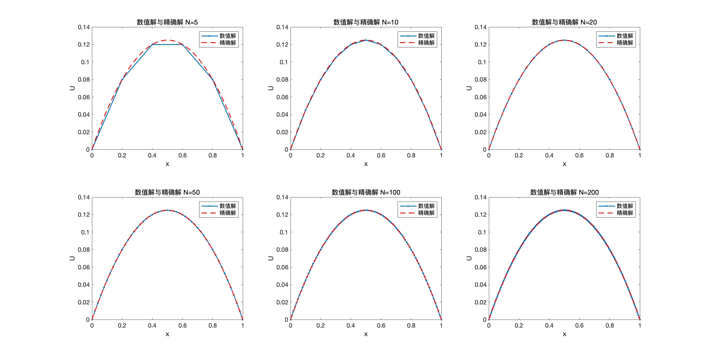

## Problem 

$$−u′′(x) = 1,  for  0 < x < 1$$

$$u(0) = u(1) = 0$$

**Program FEM to solve**

- The number of elements as n, set three different n at least and exhibit the corresponding solutions. 

- Each n, give the stiffness matrix A, the vector f and the solution u. 

- And compare FEM solution with the exact solution u(x) = 12(x − x2) by plotting them in one figure for each n

### the fem is as follow
- At first, choose 6 different n and computing`` N = [5,10,20,50,100,200]; 
x1= zeros(201,6); ``

  - K  is sumed by mutilple k block

  - f is the same sum as K

  - u is computed by``U = K\F; ``

Finally, add 0 to fix the whole solution.
```
%%  fem method
 for j = 1:length(N)
    h = 1 / N(j);
    x = 0:h:1;
    K = zeros(N(j)-1);
    K = K + diag(ones(N(j)-1,1).*(2/h), 0) + ...
                diag((-1/h).*ones(N(j)-2,1), 1) + ...
                diag((-1/h).*ones(N(j)-2,1), -1); //本文的一个k 
    F=zeros(1,N(j)-1);
    for i =1:(N(j)-1)
        F(i)=h;
    end
    F =F';
    K = sparse(K);
    U = K\F;
    solution = [0; U; 0];
    
```

### visualization
- Put precise solution and numerical soluton in the same figure:

```
  %% draw
     figure(1)
     subplot(2,3,j);
    plot(x', solution, '-o' ,xx', u_precise2,  '--r','LineWidth',1.5,'MarkerSize',2);
    legend('数值解', '精确解')
    xlabel('x')
    ylabel('U');
    title(['数值解与精确解 N=' ,num2str(N(j))]);
```
 

### error 
- Compare the precise solution and numerical soluton, achieve error visualization:
```
 if j ==1
        x1 = 0:h:1;
        u_precise11= 1/2*(x1-x1.^2);
        u_precise11= u_precise11';
        error1= u_precise11 - solution;
        error1=sqrt(error1.*error1);
end
subplot(2,3,1);
plot(x1, error1, '-o','LineWidth',2,'MarkerEdgeColor','black');
```
